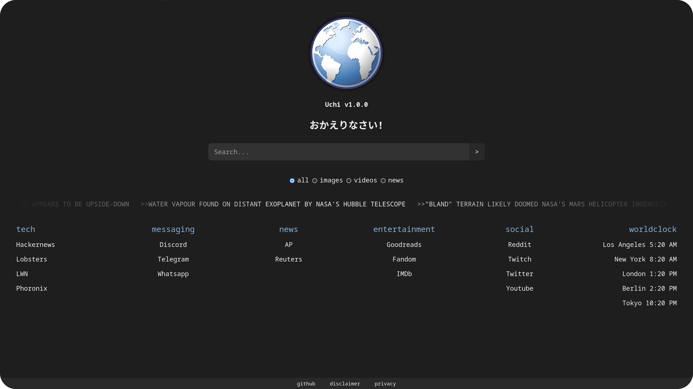

A simple startpage.

## Index

- [Features](#features)
- [Installation](#installation)
- **[Instances](#instances)**

## Features

- **lightweight**
- **responsive layout**
- **light and dark mode** support
- **asynchronous**
- strict mode JavaScript
- **quick search** for texts, images, news, videos
- a **news ticker** that shows news headlines from around the world, covering business, health, science and technology
- a **worldclock**, which automatically adjusts according to timezone and system language
- links to widely used services

### What does Uchi mean?

Uchi (Japanese: うち), is a Japanese word used to refer to one's home.

## Installation

### Prerequisites

Being a static website, Uchi only needs a small webserver such as Python's built-in: if Python is already on your system, you don't have to install anything.

### Automated (GNU/Linux only)

```bash
export XDG_DATA_HOME=${XDG_DATA_HOME-~/.local/share}
mkdir -p $XDG_DATA_HOME && cd $_
curl -LO https://github.com/hisutori/uchi/releases/latest/download/uchi.zip
unzip uchi.zip && rm uchi.zip && cd uchi
python3 -m http.server 8000
```

Open your browser and visit [http://localhost:8000](http://localhost:8000).

To start automatically the webserver at system boot, you can use a systemd unit:

```bash
export XDG_CONFIG_HOME=${XDG_CONFIG_HOME-~/.config}
mkdir -p $XDG_CONFIG_HOME/systemd/user && cd $_
{
  echo '[Unit]'
  echo "Description=Uchi's http daemon"
  echo '[Service]'
  echo 'Type=oneshot'
  echo "WorkingDirectory=$XDG_DATA_HOME/uchi"
  echo 'ExecStart=/usr/bin/python3 -m http.server 8000'
  echo '[Install]'
  echo 'WantedBy=multi-user.target'
} >> uchi.service
systemctl --user enable --now uchi.service
```

### Docker

```bash
curl -LO https://github.com/hisutori/uchi/releases/latest/download/uchi-docker.zip
unzip uchi-docker.zip && rm uchi-docker.zip
docker build -t uchi .
docker run --restart always --name uchi -d -p 8000:80 uchi
```

Open your browser and visit [http://localhost:8000](http://localhost:8000).

## Instances

| Instance | Location | HTTP3 | Cloudflare |
| -------- | :------: | :---: | :--------: |
